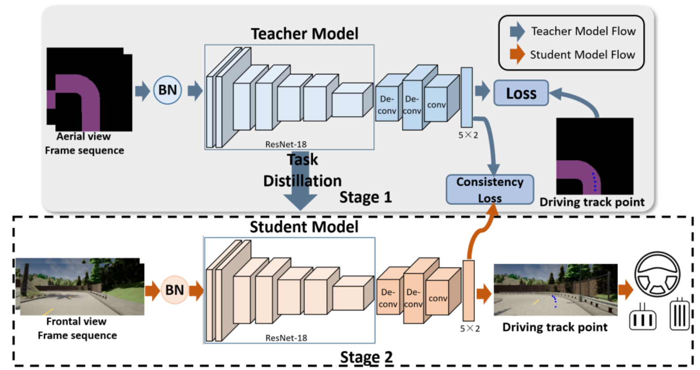
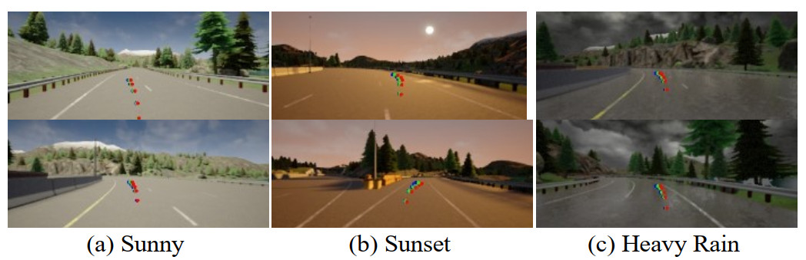

# DBC-Driving-Behavioral-Cloning

Prepared paper: Driver Behavioral Cloning for Route Following in Autonomous Vehicles Using Task Knowledge Distillation

## Approach
Planning appropriate driving trajectory for route following is an important function for autonomous driving. Behavioral cloning, which allows automatic trajectory learning and improvement, has been effectively used in driving trajectory planning. However, existing behavioral cloning methods always rely on large scales of time-consuming, laborious, and reliable labels. To address this problem, this paper proposes a new off-policy imitation learning method for autonomous driving using task knowledge distillation. This novel method clones
human driving behavior and effectively transfers the driving strategies to domain shift scenarios. The experiment results indicate that our method can lead to satisfactory route-following performance in realistic urban driving scenes and can transfer the driving strategies to new unknown scenes under various illumination and weather scenarios for autonomous driving. 
<div align=center></div>

## How to use code
### Simulator：Carla 0.9.9.2
Download [link](https://github.com/carla-simulator/carla)
### Datasets
You can download dataset from: [BaiduPan](https://pan.baidu.com/s/18w2rpbj-4knxwaefO7c-8w?pwd=0810). password：0810 

### Training
#### Stage 1
Below script gives you an example of training a teacher model.
```
python train_stage1.py --dataset_dir PATH:/CarlaDatasets/Route0_Noon --source stage1 --input_channels 4
```
#### Stage 2
Below script gives you an example of training a model with teacher model trained in stage 1.
```
python train_stage2.py --dataset_dir PATH:/CarlaDatasets/Route0_Noon --source stage2 --input_channel 6 --teacher_path ./wandb/stage1_output_model.t7
```
### Evaluation
Below script gives you an example of testing EVS/RMSE/MAE.
```
python eval_metric.py --dataset_dir PATH:/CarlaDatasets/Route0_Noon --source eval --model_path ./wandb/stage2_output_model.t7
```


## Results
The result is as follows:
<div align=center></div>
The video demonstrations of all the above experiments can be found at [Youtube](https://youtu.be/IPHR-7awYk0)

